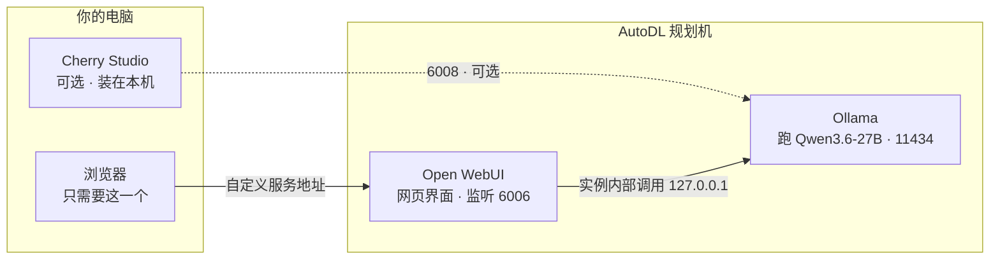
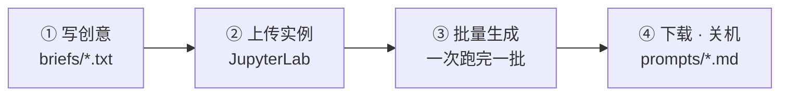

# 04 · 规划机选型（跑本地提示词模型）

> 背景：家里那张 12GB 显卡暂时不在手上，需要先租一台便宜机器跑「本地文字模型」，负责把中文创意转写成 H3 提示词。
> 结论：**RTX 3090 / 24GB / ¥1.32 每小时。**
>
> ⚠ **本文是初版方案，部分内容已被 `05-解禁模型与主机调整.md` 取代，以 05 为准。** 主要差异：
> - 模型从官方 `qwen3.6:27b` 换成解禁版 `JonathanColetti/Qwen3.8-27B-Uncensored`（Q4_K_M）
> - 地区选**内蒙B区 ¥1.48/时**（不是本文的北京A区 ¥1.32，那边库存不稳）
> - 推理引擎从 Ollama 换成 `llama.cpp` 的 `llama-server`
> - **端口从 11434 改为 6006**，因为 AutoDL 只映射 6006/6008，绑 11434 就没有网页入口（详见 05 文档 9.11）
> - 本文第三节里"用 Open WebUI 做界面"的方案已不需要——`llama-server` 自带聊天界面

---

## 一、决定性变量是显存，不是算力

文字模型是单条流式输出，算力基本用不满。真正卡脖子的是**显存能装下多大的模型**，其次是显存带宽（决定生成速度）。

Q4_K_M 量化下，每个参数约占 **0.58 字节**；再给 KV 缓存和运行时留 1–2GB：

| 显存 | 权重预算 | 实际能跑的档位 |
| --- | --- | --- |
| 12GB | ~10GB | ~17B，舒服的是 14B 级别 |
| 16GB | ~14GB | ~22B，但只剩 2GB 给上下文 |
| **24GB** | **~20GB** | **~34B，还有充足余量** |

**为什么必须上 24GB**：这个模型的任务是**严格结构化输出**——固定三字段（`integrated_multimodal_description` / `overall_soundscape` / `non_diegetic_music`），外加 `<d>` 对白标签、`(S1)` 说话人编号、`At 00:03.500` 时间戳格式。这正是 14B 级别最容易翻车的场景：丢字段、标签错位、中英文混杂。27B 级别才稳。

---

## 二、三张卡的定位

| 卡 | 显存 | 带宽 | 价格 | 结论 |
| --- | --- | --- | --- | --- |
| RTX A4000 | 16GB | 448 GB/s | ¥0.92/时 | 最不划算 |
| RTX 3080Ti | 12GB | 912 GB/s | ¥0.98/时 | 排除（复刻已有能力） |
| **RTX 3090** | **24GB** | **936 GB/s** | **¥1.32/时** | **选它** |

**A4000 为什么最不划算**：只比 3080Ti 便宜 ¥0.06/时，显存带宽却只有一半（448 vs 912 GB/s），同尺寸模型下生成速度差约一倍。16GB 又是尴尬的中间档——跑 24B 4-bit 只剩 2GB 给上下文，跑 14B 又用不满。

**3080Ti 为什么排除**：带宽 912 GB/s 很强，单价也最低，但**家里已经有一张 12GB 卡**。租它等于复刻已有能力，等那张卡到手，这台机器带来的增量归零。这是排除它的决定性理由，不是性能问题。

**3090 为什么值**：24GB 跨过了「能跑好模型」的门槛，带宽也最高。比 3080Ti 每小时贵 ¥0.34，一次两小时的规划会话多花 ¥0.68。为省七毛钱把模型降一档，不划算。

---

## 三、跑哪个模型

| 模型 | 类型 | Q4_K_M 占用 | 说明 |
| --- | --- | --- | --- |
| **Qwen3.6-27B** | dense | ~16GB | **首选**。中文母语级，256K 上下文，Apache 2.0，还剩约 8GB 余量 |
| Qwen3.6-35B-A3B | MoE | ~20GB | 生成最快（每 token 只激活 3B），但吃满显存，上下文要压着用 |
| Mistral Small 3.2 24B | dense | ~14GB | 指令遵循最扎实，最省显存，能塞更长上下文 |
| DeepSeek-R1-Distill-Qwen-32B | dense | ~18–20GB | 推理最深，但输出带思维链，写提示词用不上反而拖慢 |

> ⚠️ **MoE 的坑**：MoE 的显存按**总参数**算，不是激活参数。Qwen3.6-35B-A3B 每次只激活 3B，但全部 35B 都要常驻显存。

**如果只有 16GB**（比如选了 A4000）：Mistral Small 3.2 24B 或 gpt-oss-20b（都约 14GB）能跑；Qwen3.6-27B 会非常挤。

---

## 四、先把模型跑起来

AutoDL 上用 Ollama 最省事，自带 OpenAI 兼容接口：

```bash
curl -fsSL https://ollama.com/install.sh | sh
ollama serve &
ollama pull qwen3.6:27b
```

**先让 Ollama 只监听本机**（`127.0.0.1:11434`，默认值）。因为后面会用一个网页界面把端口暴露出去，Ollama 自己不需要对外。端口怎么分见下一节。

---

## 五、用什么软件操作

先分清**软件装在哪台机器上**——这是最容易绕晕的地方。答案是：两个软件都装在租来的实例上，本地只需要一个浏览器。



每次使用的流程只有四步，其中真正需要你动手的只有第 1 步和第 4 步：



开机后的完整命令序列：

```bash
ollama serve &                                   # 启动模型服务
open-webui serve --port 6006 --host 0.0.0.0 &    # 启动网页界面
```

然后控制台「自定义服务」→ 浏览器打开 → 就是你的提示词工作台。要批量跑时：

```bash
python batch-prompts.py --briefs briefs --out prompts
```

下面按用途把四种方式拆开讲。

### 方式 A · JupyterLab 终端（零配置，开机先验证用）

```bash
ollama run qwen3.6:27b
```

直接在实例的 JupyterLab 终端里对话。适合开机后第一件事——确认模型能跑、输出格式对不对。缺点是长提示词粘贴麻烦，历史不留档。

### 方式 B · Open WebUI（推荐的日常主力）

跑在实例上的网页界面，浏览器打开就能用，体验接近你熟悉的大模型对话。

⚠️ AutoDL 的容器实例内**不能用 Docker**，官方那条 `docker run` 装不了，要用 pip：

```bash
pip install open-webui
open-webui serve --port 6006 --host 0.0.0.0
```

然后在控制台点「自定义服务」，用给出的地址在本地浏览器打开。

**为什么放 6006**：AutoDL 只有 **6006 和 6008** 两个端口默认做了公网映射，其他端口要企业认证才能开放。Open WebUI 在实例内通过 `127.0.0.1:11434` 访问同机的 Ollama，所以 Ollama 本身不用暴露出去。

在 Open WebUI 里可以做两件省事的事：

- 把 `docs/03-H3提示词写法.md` 最后一节的系统指令存成一个「模型 / 助手」，之后每次直接选它，不用重复粘贴
- 把片段规划表作为参考文件上传，让它按表逐段输出

### 方式 C · 本地桌面客户端（想在本机舒服打字时用）

**Cherry Studio** 是 CherryHQ 开发的一款开源免费桌面 AI 客户端（Windows / macOS / Linux，Apache 2.0），作用是把 30 多家模型服务商——OpenAI、Claude、Gemini、DeepSeek、通义等——加上本地模型，统一到一个界面里，另外带知识库、MCP 工具和提示词管理。**Chatbox** 是同类里更轻的一个选择。

它们都支持自定义 OpenAI 兼容地址，所以可以直接连远程 Ollama。需要把 Ollama 暴露到 **6008**：

```bash
OLLAMA_HOST=0.0.0.0:6008 ollama serve &
```

客户端里 Base URL 填 `https://<自定义服务地址>/v1`。

> ⚠️ **Ollama 的原生 API 没有任何鉴权。** 暴露到公网等于把这张按小时计费的卡借给任何拿到链接的人。只在需要时开，用完改回 `127.0.0.1:11434`。

### 方式 D · 批处理（这才是你的主力）

按 `docs/02-每次创作流程.md` 的纪律，你是「一次开机把整批提示词写完再关机」。这是批处理，不是聊天——用一个 JupyterLab notebook 循环调 API 最合适：

```python
import pathlib, requests

BRIEFS = pathlib.Path("briefs")     # 每条创意一个 txt
OUT = pathlib.Path("prompts"); OUT.mkdir(exist_ok=True)
SYSTEM = pathlib.Path("system-prompt.txt").read_text(encoding="utf-8")

for f in sorted(BRIEFS.glob("*.txt")):
    r = requests.post("http://127.0.0.1:11434/v1/chat/completions", json={
        "model": "qwen3.6:27b",
        "messages": [
            {"role": "system", "content": SYSTEM},
            {"role": "user",   "content": f.read_text(encoding="utf-8")},
        ],
        "temperature": 0.7,
    }, timeout=900)
    r.raise_for_status()
    (OUT / f"{f.stem}.md").write_text(
        r.json()["choices"][0]["message"]["content"], encoding="utf-8")
    print("done", f.stem)
```

跑完把 `prompts/` 整个下载回本地，然后关机。

好处是输入输出全是文件：可复现、可 diff、可版本管理，不依赖任何界面的会话状态。想换模型或改系统指令，改一行重跑就行。

### 端口分配速查

| 端口 | 用途 | 谁访问 |
| --- | --- | --- |
| `127.0.0.1:11434` | Ollama 本体 | 实例内部（Open WebUI、notebook） |
| `6006`（公网映射） | Open WebUI 网页界面 | 你的浏览器 |
| `6008`（公网映射） | 可选：Ollama API 直连 | 本地桌面客户端 |

规划机不和 ComfyUI 同机，所以 6006 / 6008 都空着，随便分。

### 建议的组合

- **第一次开机**：方式 A，确认模型能跑、格式对不对
- **日常调提示词**：方式 B，Open WebUI 里对着系统指令反复磨
- **批量产出**：方式 D，notebook 一把跑完，存成文件，关机
- **想在本机舒服打字**：方式 C，但记得只在使用时开放端口

> 如果以后一批要写几十条以上，Ollama 是串行处理会比较慢，可以考虑换 vLLM（连续批处理，吞吐高很多），代价是安装麻烦、要用 AWQ/GPTQ 权重而不是 GGUF。第一阶段没必要。

---

## 六、使用纪律

规划机和生成机的使用模式完全不同：

| | 生成机 | 规划机 |
| --- | --- | --- |
| 负载 | 短时高负载 | 长时低负载 |
| 典型用法 | 开机 1 小时跑几条 | 断断续续想几小时 |
| 风险 | 忘了关机 | **开着卡想提示词** |

按量计费下，开着规划机发呆就是在烧钱。所以：

- **一次开机把整批提示词写完，然后立刻关机。**
- 规划机平时保持关机状态，只在写提示词时开。
- 提示词草稿存在本地 `prompts/` 里，不放在实例上。

---

## 七、家里的 12GB 卡到手后


先别急着换卡。在 3090 上做一轮对照实验：

1. 拿同一批创意（建议 10 条以上），分别用 14B 级别和 Qwen3.6-27B 生成提示词；
2. 统计两边的「一次通过率」——即生成出来的提示词能直接扔进 H3 跑、不需要手动改字段和标签的比例；
3. 再把这批提示词分别丢给 H3 生成，看成品质量的差距。

**这个结论决定你要不要升级家里的卡，比省下的 ¥0.34/时值钱得多。** 结果记进 `records/`。

如果 14B 的一次通过率能到 80% 以上，那就用家里的 12GB 卡就够，这台 3090 只当临时过渡。如果 14B 一半都要返工，那 24GB 就是刚需，该换卡。
